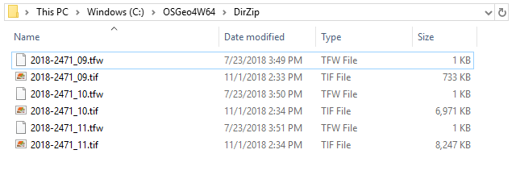
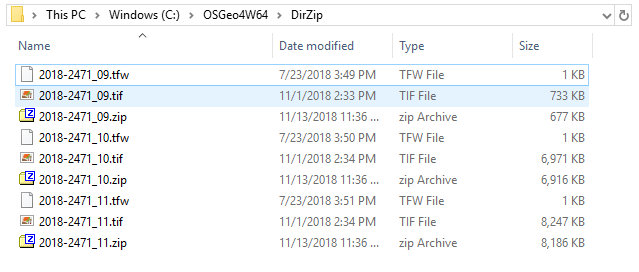

# ZipTifPairs
This python script was written to zip up sets of files in a given directory.

## Getting Started
This script was designed to run with OSGeo4W64 installed.
"SourceDirectory" is a required parameter.
All *.tif and *.tfw files in the Source Directory are grouped by file name and zipped into an archive by the same name.

### Installing
Confirm OSGeo is installed (https://trac.osgeo.org/osgeo4w/).

Copy "zippairs.py" into your OSGeo folder, then launch the OSGeo batch file. This script can be run from the OSGeo command line.

### Example 
Below is a screenshot of the example directory. (before executing the script)

Next we run the script.

	zippairs.py  C:\OSGeo4W64\DirZip

The script crawls the source directory and creates a zip file for each name. (as shown below)

### Usage
	usage: zippairs.py SOURCE
	
	Zip sets of files in the source directory
	
	required arguments:
	  SOURCE      Full directory path

## Notes

### Questions
What happens if this is run twice on the same folder?

How are sub-directories handled?

What if there is a *.tif without a *.tfw?

What if files match by name with other extensions? (They are ignored)
